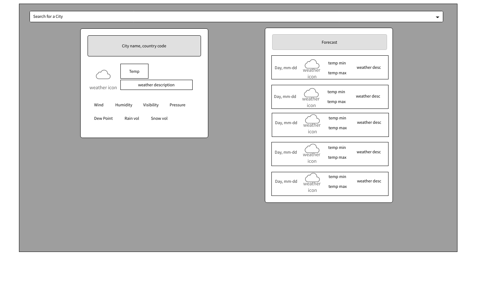
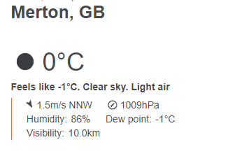
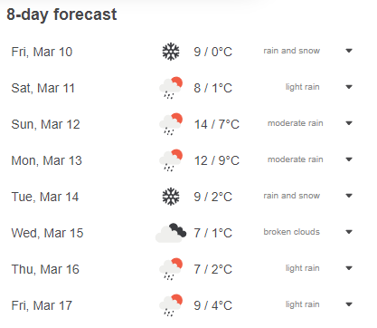

# Weather App

## Description

React app that consumes the OpenWeather API to get the current weather for a given city. As part of General Assembly's Software Engineering Immersive course.

This is a simple weather app that uses the aforementioned API, inbuilt JavaScript Geolocation API to automaticaly get the latitude and longitude of the users position, as far as the user allow it on browser, and GeoDB Cities API on the search bar that returns city name, country name, latitude and longitude of the searched city.

## Getting Started

The project can be accessed on **[my Git Hub profile on React-weater repository.](https://github.com/scarlosteixeira/react-weather)** <br>
This project is open source and can be downloaded, used and modified by anyone, as far as credit is given.

Solo project, to be completed within 1 week, split as it follows: <br>

1. 1 day of whiteboarding and singing off.
2. 2 days for research, development and coding.
3. 2 days to get a minimum viable project.
4. 1 days for polishing, bug fixing.
5. 1 day to present the completed project.


## Technologies Used
* React
* React DOM
* react-select-async-paginate
* TypeScript
* Bootstrap
* HTML 5
* VS Code
* Google Chrome

## Brief

### Overview

The second project is to **build a React application** that consumes a **public API**.

### Technical Requirements

Your app must:

* **Consume a public API** – this could be anything but it must make sense for your project.
* **Include wireframes** - that you designed before building the app.
* Have **semantically clean HTML** - you make sure you write HTML that makes structural sense rather than thinking about how it might look, which is the job of CSS.
* **Be deployed online** and accessible to the public.

## Planning

I started by choosing the API that I wanted to use. I decided to use the **[OpenWeather API](https://openweathermap.org/api)**, from a list of public API`s provided by my instructor. I also decided to use the **[GeoDB Cities API](https://rapidapi.com/wirefreethought/api/geodb-cities)**, because it was the one that I found that had the most information about the cities, and it was the one that I could use to get the latitude and longitude of the searched city. I also decided to use the JavaScript **[Geolocation API](https://developer.mozilla.org/en-US/docs/Web/API/Geolocation_API)**, as it was the one that I found that was easy to use. 

I made a simple wireframe of the app, using **[wireframepro from mockflow.](https://wireframepro.mockflow.com/)**. The wireframe was based on the layout of the **[open weather app](https://openweathermap.org/)**, but with some modifications to make it simpler, due to the time constraints. The current weather and forecast weather has been choosen as starting point for the app.


 


## Technical Reference

**[OpenWeather Current Weather API](https://openweathermap.org/current)** <br>
**[OpenWeather 5 day / 3 hour Forecast API](https://openweathermap.org/forecast5)** <br>
**[GeoDB Cities API](https://rapidapi.com/wirefreethought/api/geodb-cities)** <br>
**[JavaScript Geolocation API](https://developer.mozilla.org/en-US/docs/Web/API/Geolocation_API)** <br>
**[React](https://reactjs.org/)** <br>
**[React DOM](https://reactjs.org/docs/react-dom.html)** <br>
**[react-select-async-paginate](https://www.npmjs.com/package/react-select-async-paginate)** <br>
**[react-bootstrap](https://react-bootstrap.github.io/)** <br>
**[TypeScript](https://www.typescriptlang.org/)** <br>
**[Bootstrap](https://getbootstrap.com/)** <br>
**[HTML 5](https://developer.mozilla.org/en-US/docs/Web/HTML)** <br>
**[VS Code](https://code.visualstudio.com/docs)** <br>
**[Google Chrome](https://www.google.com/chrome/)** <br>

## Build/Code Process

I used React TypeScrip to build the app. It was the first time, in a porject, that I used TypeScript, and I found it very useful, as it helped me to avoid some bugs that I would have had if I had used JavaScript. That was also the first time that I splited my code into multiple files and folders, and I found it very useful, as it helped me to keep my code organised and easy to read. I also used the **[react-select-async-paginate](https://www.npmjs.com/package/react-select-async-paginate)**, to create the search bar, and the **[react-bootstrap](https://react-bootstrap.github.io/)**, to create the layout of the app.

I fetched the data from the OpenWeather API, weatherFetch function, on App.tsx, in this way I could pass the data to the other components as props and manage the state of the app easier. I also used the JavaScript Geolocation API to get the latitude and longitude, getLocation function, in the same way.

To run these functions I used the useEffect hook, in this way I could run the getLocation function only once, when the app was loaded,
and the weatherFetch function, when the location state was updated.

```TypeScript

    // useState to store the current weather data
  const [currentWeather, setCurrentWeather] =
    React.useState<TCurrentWeather>(null)

  // useState to store the forecast weather data
  const [forecastWeather, setForecastWeather] =
    React.useState<TForecastWeather>(null)

  // useState to store the location
  const [location, setLocation] = React.useState<TLocation>(undefined)

    function getLocation() {
    // if the browser supports the geolocation
    if (navigator.geolocation) {
      // get the current position
      return navigator.geolocation.getCurrentPosition(position => {
        // setting the latitude and longitude to the state 
        const latLon = {
          lat: position.coords.latitude.toFixed(4),
          lon: position.coords.longitude.toFixed(4)
        }
        // setting the location to the state
        setLocation(latLon)
      })
    }
  }

    // function to fetch the weather data
  async function weatherFetch(location: TLocation) {
    // fetching the current weather data
    const response = await fetch(
      `${weatherApiUrl}/weather?lat=${location?.lat}&lon=${location?.lon}&appid=${weatherApiKey}&units=metric`
    )
    // fetching the forecast weather data
    const response2 = await fetch(
      `${weatherApiUrl}/forecast?lat=${location?.lat}&lon=${location?.lon}&appid=${weatherApiKey}&units=metric`
    )
    // converting the response to json
    const currentWeatherData = await response.json()
    const forecastWeatherData = await response2.json()
    // console.log(currentWeatherData);
    // console.log(forecastWeatherData);
    // setting the current weather data to the state
    setCurrentWeather({ ...currentWeatherData })
    // setting the forecast weather data to the state
    setForecastWeather({ ...forecastWeatherData })
  }

  // useEffect to get the location
  React.useEffect(() => {
    getLocation()
  }, [])// only once

  // useEffect to fetch the weather data
  React.useEffect(() => {
    // if the location is not undefined
    if (location) {
      // call the weatherFetch function
      weatherFetch(location)
    }
  }, [location])// if the location changes
```

The SearchBar component, uses the react-select-async-paginate. The search bar is used to searching for a city fetched from the GeoDB Cities API, and when a city is selected, the latitude and longitude of the city is passed to the OnSearchChange function, and the weatherFetch function is called, to fetch the weather data of the selected city.

I used some props of the async-paginate component, to get the data from the API as options and to handle user input from search bar.

* The **loadOptions** will call the API and return an object with two keys: value and label. The label has the name of the city and the country code, this label will be displayed in the search bar. The value has the latitude and longitude of the city, this value will be passed throug the handleOnChange function and assigned to the onSearchChange prop, that is a function for fetching data from OpenWeather API.

* The **onChange** will call the handleOnChange function, this function has been explained above. onChange, basically, monitors the user input for changes.

* The **value** will be assigned by the search useState, it contains both label and value of the selected city. The search useState is assigned by the handleOnChange function.

* The **debounceTimeout** will set the time for the user to stop typing before the API is called.

```TypeScript
// SearchBar component
const SearchBar = ({ onSearchChange }:SearchBarProps ) => {
  // setting the search state
  const [search, setSearch] = useState<Search>(null)

  // function to load the options "loadOptions generates the options from the API"
  const loadOptions = async (inputValue:InputValue) => {
    // fetching the data from the GeoDB Cities Api
    const response = await fetch(
      `${geoApiUrl}/cities?minPopulation=10000&namePrefix=${inputValue}`,
      geoApiOptions
    );
    const resp = await response.json();
    // console.log(resp)
    return {
      options: resp.data.map((city: ICityData) => {
        return {
          value: `${city.latitude} ${city.longitude}`,
          label: `${city.name}, ${city.countryCode}`,
        };
      }),
    };
  };

   // function to handle data entered in the search bar
  const handleOnChange = (searchData:Search) => {
    // console.log(searchData,'searchData')
    
    setSearch(searchData)
    onSearchChange(searchData)
  }

  return (
    <AsyncPaginate className="mx-auto my-3"
      placeholder="Search for a city"
      debounceTimeout={600}
      value={search}
      onChange={handleOnChange}
      loadOptions={loadOptions}
    />
  )
}
```

The CurrentWeather component, is responsible for displaying the current weather data. It also handles the conversion of the wind speed and direction, from a numeric value, meaningless to the user to a string , which is easy to understand. 

* The wind speed is converted from m/s to a description, this conversion is based on the **[Beaufort scale](https://en.wikipedia.org/wiki/Beaufort_scale)**. That correlates the wind speed, wind description, wave height, sea condition and land condition.

* The wind direction is converted from azimuth degrees to a cardinal point abbreviation, this conversion is based on the **[Wind rose](https://uni.edu/storm/Wind%20Direction%20slide.pdf)**. 

```TypeScript
// CurrentWeather component
function CurrentWeather ({currentWeatherData}:CurrentWeatherProps) {
  // useState to store the wind condition
  const [windCondition, setWindCondition] = React.useState<string>('wind condition')
  // useState to store the wind direction
  const [windDirection, setWindDirection] = React.useState<string>('wind direction')
// console.log(currentWeatherData);

// function to get the wind condition
function windConditionFunc () {
  // filtering the wind speed from the windSpeed array
  const filteredwindSpeed = windSpeed.filter((condition)=>{
    // checking if the current wind speed is between the min and max speed
    if(currentWeatherData?.wind.speed >= condition.speedMin && currentWeatherData?.wind.speed <= condition.speedMax ) {
    return condition
    }
  })
  // returning the wind condition description
  return filteredwindSpeed.map((data)=>{
    return data.description
  })
}

// function to get the wind direction
function windDirectionFunc () {
  // filtering the wind direction from the windDirect array
  let filteredWindDirection = windDirect.filter((direction)=>{
    // checking if the current wind direction is between the min and max degree
    if(currentWeatherData?.wind.deg >= direction.degree[0] && currentWeatherData?.wind.deg <= direction.degree[1] ) {
      // console.log(currentWeatherData.wind.deg)
      // console.log(direction.degree[0])
      // console.log(direction.degree[1])

      // returning the wind direction
      return direction
      } 
  }) 
  // checking if the wind direction is between 350 and 10 degree, North
  if (currentWeatherData?.wind.deg >= 350 || currentWeatherData?.wind.deg <= 10 ){
    // returning the wind direction
    return windDirect[15].direction
  }
    // console.log(filteredWindDirection)

  // returning the wind direction
  return filteredWindDirection.map((data)=>{
    return data.direction
  })
}

// useEffect to set the wind condition and wind direction
React.useEffect(()=>{
  // calling the wind condition function and storing the result in windDescription variable
  const windDescription = windConditionFunc()
  // calling the wind direction function and storing the result in windDirection variable
  const windDirection = windDirectionFunc()
  // setting the wind condition
  setWindCondition(windDescription[0])
  // setting the wind direction
  setWindDirection(windDirection[0])
},[currentWeatherData]) // update the wind condition and wind direction when the currentWeatherData changes
```

The ForecastWeather component, is responsible for displaying the forecast weather data. It also handles the formatting of the forecastWeatherData.list array, to display the data in a more readable way. 

```TypeScript
// weekDays array
const weekDays = [
  'Monday',
  'Tuesday',
  'Wednesday',
  'Thursday',
  'Friday',
  'Saturday',
  'Sunday'
]
// ForecastWeather component
function ForecastWeather({ forecastWeatherData }: ForecastWeatherProps) {

  // setting the weatherData state
  const [weatherData, setWeatherData] = React.useState<any>(null)
  // getting the current day of the week
  const dayOfWeek = new Date().getDay()

  // getting the next 6 days of the week
  const forecast6Days = weekDays
    .slice(dayOfWeek, weekDays.length)
    .concat(weekDays.slice(0, dayOfWeek))
    .slice(0, 6)

  // function to format the forecast data, it will take the forecastWeatherData.list array, that is a list of 40 objects, with the weather of next 5 days / 3 hours, and turn it into an array of arrays, where each array represents the weather of a day, and each object inside the array represents the weather of a 3 hours interval.
  function formatedForecastData() {
    let count = 0
    let date: Array<string> = []
    let newArray = []
    
    // getting the dates of the next 5 days
    forecastWeatherData?.list?.map(
      (data: { dt_txt: string }, index: number) => {
        
        // if the date of the current object is the same as the next object, then it will be added to the date array, if not, then the count will be increased, and the date will be added to the next index of the array.
        if (
          data?.dt_txt.slice(0, 10) ===
          forecastWeatherData?.list[index + 1]?.dt_txt.slice(0, 10)
        ) {
          date[count] = data.dt_txt.slice(0, 10)
          
        } else {
          count++
        }
      }
    )

    // if the first element of the date array is empty, then it will be removed
    if (!date[0]) {
      date.shift()
    }
    
    // filtering the forecastWeatherData.list array, and adding the objects that have the same date as the date array, to the newArray
    for (let index = 0; index < date.length; index++) {
      const auxday = date[index]
      newArray[index] = forecastWeatherData?.list?.filter(
        (data: { dt_txt: string}) => {
          return data.dt_txt.slice(0, 10) === auxday
        }
      )
      setWeatherData(newArray)
    }
  }

  // useEffect to call the formatedForecastData function when the forecastWeatherData changes
  React.useEffect(() => {
    formatedForecastData()
  }, [forecastWeatherData])
```

The ForecastCard component, is responsible for displaying the forecast weather data of a specific day. It handles the min and max temperature of the day, the function tempMaxMin will iterates through the dataset prop, getting the highest and the lowest temps on the array and sets the tempMin and tempMax useStates. 

```TypeScript
  const [tempMin, setTempMin] = React.useState<number>(0)
  const [tempMax, setTempMax] = React.useState<number>(0)
  // console.log(dataset)

  // function to get the max and min temperature of the day
  function tempMaxMin() {

    const temps = [] as Array<number>
    // iterating through the dataset array, and pushing the temperature of each object to the temps array
    dataset?.map((data: { main: { temp: number } }) => {
      return temps.push(data.main.temp)
    })
    // console.log(temps)
    // sorting the temps array, so the lowest temperature will be in the first index, and the highest temperature will be in the last index
    temps.sort((a, b) => a - b)
    // console.log(temps)
    // setting the tempMin and tempMax states
    setTempMin(Math.round(temps[0]))
    setTempMax(Math.round(temps[temps.length - 1]))
  }

  // useEffect to call the tempMaxMin function
  React.useEffect(() => {
    tempMaxMin()
  }, [dataset]) // when the dataset changes. 
```
## Challenges

### Typescript
By far Typescript was the biggest challenge, It was intruduced not that long ago, and I used it just basically. I worked a lot on main types and tryed to use them as much as possible. In some cases I had to use the type any, but I tried to avoid it as much as possible.  

you can see below some of the interfaces and types that I used in the project.
```TypeScript
export interface ICurrentWeather {
  city: string,
  coord: {lon:number, lat: number},
  weather: [{id: number, main: string, description: string, icon: string }],
  base: string,
  main:{temp: number, feels_like: number, temp_min: number, temp_max: number, pressure: number, humidity: number, sea_level: number, grnd_level: number},
  visibility: number,
  wind: {speed: number, deg: number, gust:number},
  rain: {["1h"]: number, ["3h"]:number},
  snow: {["1h"]: number, ["3h"]:number},
  clouds: {all:number},
  dt: number,
  sys: {type: number, id: number, country: string, sunrise: number, sunset: number, message: string}
  timezone:number,
  id: number,
  name: string,
  cod: number
}

export interface ICityData {
  name: string
  countryCode: string
  latitude: number
  longitude: number
}

interface IWindCondition{
  speedMin: number,
  speedMax: number,
  description: string
}

interface IWindDirection{
  direction: string,
  degree:Array<number>
}
export type TWindDirection = Array<IWindDirection>
export type TWindCondition = Array<IWindCondition>
export type TCurrentWeather = ICurrentWeather | null | undefined
```
## Wins

The way that I handled the wind condition was a win for me, it took me some research to convert the wind speed to a wind condition, but I found the Beaufort scale that fits perfectly on my project. I just had to translate it from the original scale to TypeScript code.

```TypeScript
export const windSpeed: TWindCondition =[
  {speedMin: 0,
    speedMax:0.5,
  description: 'Calm'
  },
  { speedMin:0.6,
    speedMax: 1.5,
    description: 'Ligth Air'
  },
  { speedMin: 1.6,
    speedMax: 3.3,
    description: 'Light breeze'
  },
  { speedMin:3.4,
    speedMax:5.5,
    description: 'Gentle breeze'
  },
  { speedMin:5.6,
    speedMax:7.9,
    description: 'Moderate breeze'
  },
  { speedMin:8,
    speedMax:10.7,
    description: 'Fresh breeze'
  },
  { speedMin:10.8,
    speedMax:13.8,
    description: 'Strong breeze'
  },
  { speedMin:13.9,
    speedMax:17.1,
    description: 'Near gale'
  },
  { speedMin:17.2,
    speedMax:20.7,
    description: 'Fresh gale'
  },
  { speedMin:20.8,
    speedMax:24.4,
    description: 'Severe gale'
  },
  { speedMin:24.5,
    speedMax:28.4,
    description: 'Storm'
  },
  { speedMin:28.5,
    speedMax:32.6,
    description: 'Violent storm'
  },  
  { speedMin:32.7,
    speedMax:100,
    description: 'Hurricane'
  },
]
```

## Key Learnings/Takeaways
I got a better understanding of code splitting, and how to use it in a React project, as well as dependency importing. NPM packages are a great way to save time and effort, it also pushed me to read the documentation of the packages that I used, and learn how to use them.

React is a great framework, it is easy to use, and it is very flexible. Render html elements from the code is a great way to integrate TypeScript code that controls the logic of the app, and the html elements that are rendered.

I made a good progress in bootstrap, it still not perfect, but I could implement some responsivity to the app.

I also made a good progress in TypeScript, I still have a lot to learn, but I feel more confortable using it.
## Bugs
No bugs to report.

## Future Improvements
Implement more responsivity to the app, and make it more mobile friendly. 

Handle html elements with bootstrap to make screen transitions smoother. 

Implement a layout closer to the original design from openWeather app.

Implement a .env file to keep the API keys safe.